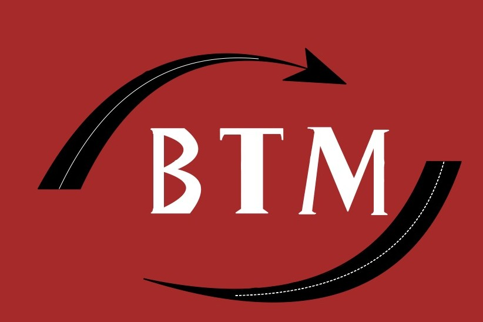

// V1

<header class="header">
        

            

                <!-- Section gauche : Logo + Menu déroulant -->
                

                    
                    <a href="index.html">
                    

                        
                    

                    </a>
                    
                    

                        <a href="transport.html" class="contact">
                            
 Transport de marchandises 

                        </a>

                         

                        <a href="demenagement.html" class="contact">
                            
 Déménagement 

                        </a>

                        

                        <a href="messagerie.html" class="contact">
                            
 Messagerie 

                        </a>
                    

                

    
                <!-- Section droite : Bouton "Connect/Login" -->
                

                    <a href="contact.html" class="login-button">Contact</a>
                

            

        

    </header>

// V2 

<header class="header">
        

            

                <!-- Section gauche : Logo + Menu déroulant -->
                

                    <a href="index.html">
                        

                            
                        

                    </a>
                

                
                <!-- Section centrale : Menu déroulant (mobile responsive) -->
                

                    <a href="transport.html" class="contact">
                        
Transport de marchandises

                    </a>
                    
                    <a href="demenagement.html" class="contact">
                        
Déménagement

                    </a>
                    
                    <a href="messagerie.html" class="contact">
                        
Messagerie

                    </a>
                

    
                <!-- Section droite : Bouton "Contact" -->
                

                    <a href="contact.html" class="login-button">Contact</a>
                

            

        

    </header>

// Contact

        

            

                <b>AAAFrance</b>
                
                    
                
                <b> +33 6 27 95 85 36 </b>
            

            
               
            

                

                    <ul class="link-list">                       
                        

                    </ul>
                

            

        

        

            

                <b>Maroc</b>
                
                    
                
                <b> +212 5 28 30 80 90 </b>
                
                    
                
                <b> +212 6 66 12 14 16 </b>
            

               
            

                

                    <ul class="link-list">                        
                        

                    </ul>
                

            

        

    

